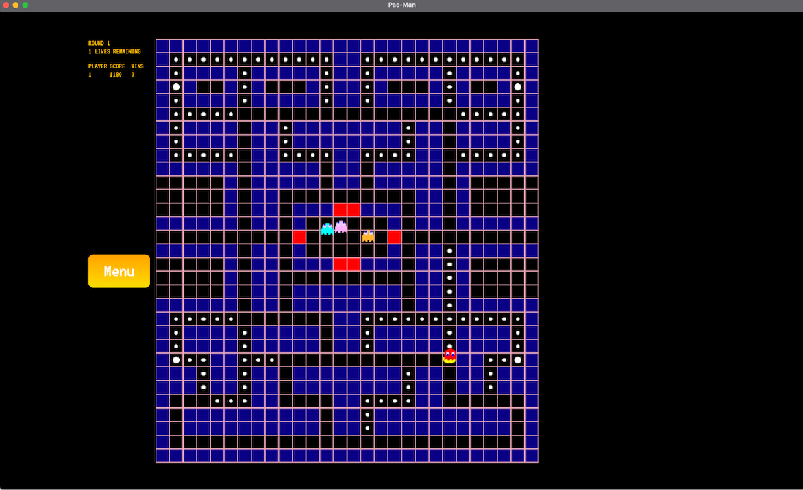
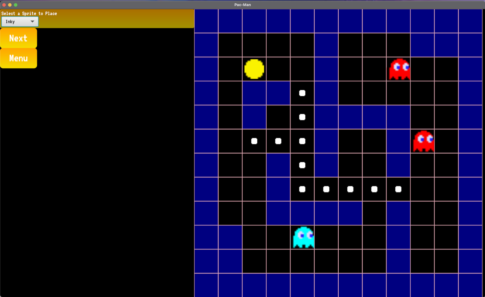
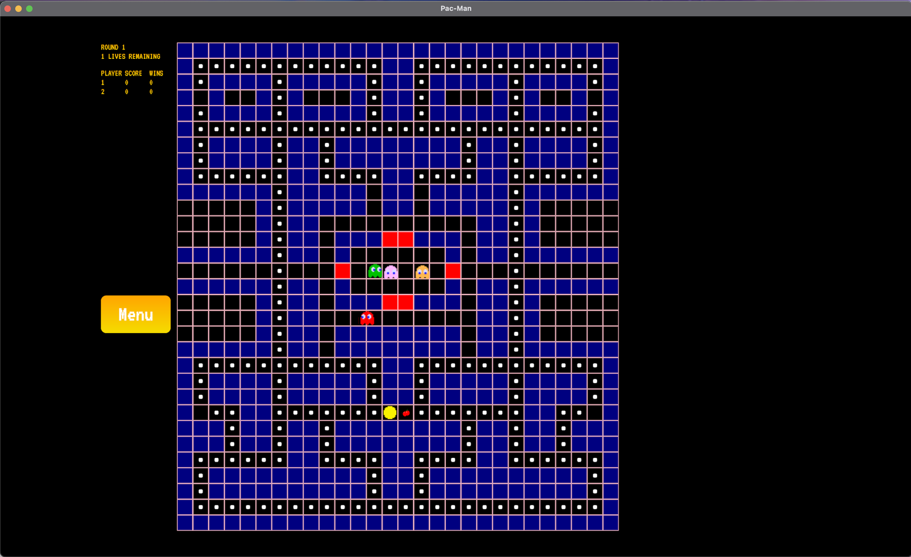

OOGA-Man
====

This project implements a Pac-Man engine that is able to emulate the classic game-mode as well as other
variations on the original to illustrate our data-driven design.

### Demo
_Please click on the following video link to see a demo of the various Pac-Man levels available and the level builder:_

### In-Game Clips
_Classic Mode, Original Map:_

_Level Builder Support:_

_Two-Player, Adversarial Mode:_

Team:

- Matthew Belissary (mab185)
- Marc Chmielewski (msc68)
- David Coffman (djc70)
- George Hong (grh17)
- Franklin Wei (fw67)

### Timeline

Start Date: 3/23/21

Finish Date: 4/25/21

Hours Spent:

- 500 man-hours across planning and implementation

### Primary Roles

Backend:

* Matthew:
    * Ghost sprites, their state AI, and power-ups
* Marc:
    * JSON serialization and deserialization, tests, different game modes, and level builder
* George:
    * Movement system, specific Ghost AI, different game modes, and level builder
* Franklin:
    * Audio and Animations for sprites. Game start/end behavior and animations.

Frontend:

* David:
    * All menus, buttons, and views displayed in the game. Also languages, mods, and themes.
        * David earned the OOGA Medal of Honor for this one. Seriously. This was a lift.

### Resources Used

* [The Pac-Man Dossier](https://www.gamasutra.com/view/feature/3938/the_pacman_dossier.php?print=1)
    * General information about the original 1980 version of Pac-Man
* [Google's Pac-Man 30th Anniversary Doodle](https://www.google.com/search?q=play+pacman+doodle)
    * Sprites and sound files
    * Reverse-engineered parts of the original Pac-Man logic from Google's JavaScript

### Running the Program

Main class:

* ooga.Main

Data files needed:

- Levels are stored in data/levels as JSON files.
    - Some of these no longer work, but are left in for legacy/testing purposes. (I'm looking at
      you `test_level.json`) In the event that one of these levels are loaded, the program will
      gracefully handle the exception and notify the user that they have tried to load an invalid
      level.
- Themes are stored in data/themes.
- Languages and other locale information are stored in the resources directory.

All errors are handled gracefully and displayed to the user as dialog boxes.

Features implemented:

* Classic Pac-Man:
    * Unique Ghost AI that pathfind to Pac-Man
    * Multiple types of power-ups that affect various sprites
    * Animations and sound for movement, power-ups, and game transitions
* Chase Pac-Man:
    * Breadth-First-Search Algorithm implemented for Pac-Man to run away from ghosts
    * Player can dynamically swap between which ghost is controlled by the player and which ghosts
      are AI-driven
* Adversarial Pac-Man:
    * 2 players (1 in control of Pac-Man and 1 in control of the Ghosts) can play simultaneously on
      the same keyboard
    * Player in control of ghosts can dynamically swap between which ghost is controlled by the
      player and which ghosts are AI-driven
* Pac-Man Level Builder:
    * The ability to build arbitrary Classic Pac-Man levels, and save them as easy to parse JSON
      files.

### Notes/Assumptions

Assumptions or Simplifications:

* Classic Pac-Man:
    * Pac-Man starts with 3 lives
    * When all dots are consumed, MovableSprites increase in speed up to a point
    * **Pac-Man is controlled by WASD**
* Chase Pac-Man:
    * Each game is only 1 round
    * Pac-Man wins upon surviving 45 seconds.
    * Ghosts win upon catching Pac-Man.
    * **Ghost is controlled by WASD**
        * **Ghosts can be swapped with the Q key**
    * The currently controlled ghost is visually indicated in a blinking green/yellow style.
* Adversarial Pac-Man:
    * Each game is only 1 round
    * **Pac-Man is controlled by WASD**
    * **Ghost is controlled by IJKL**
        * **Ghosts can be swapped with the U key**
* Pac-Man Level Builder:
    * After any stage of the level builder has been completed, the changes are *committed* and
      cannot be reverted without starting over.
    * There will only ever be one Pac-Man on the grid at any point in time.
    * The Level Builder does not currently support teleporters; those must be added manually.
    * The Level Builder assumes that you are building levels for the CLASSIC game mode; alternative
      game-modes can be specified by altering the JSON.

Interesting data files:

* `classic_pacman.json` - The Classic Pac-Man level. It's a very large level that demonstrates all
  of the features that we've developed for that portion of the code.
* `chase_pacman.json` - The Classic Pac-Man level in chase mode. You play as the ghosts and try to
  kill Pac-Man before he either eats all the dots or runs away. Your currently active Ghost is the
  one that is flashing yellow and green, and you can swap ghosts by pressing `Q`.
* `adversarial_pacman.json` - The Classic Pac-Man level in adversarial mode. Player 1 is Pac-Man and
  Player 2 is the ghosts. Chase mode rules apply, but you can't run away as Pac-Man. Player 2 should
  press `U` to swap ghosts.
* `fishbowl_pacman.json` - A self-playing demo of Classic Pac-Man. Look ma! No hands!
* `murder_maze.json` - The Classic Pac-Man level from hell. Try to survive. You won't. :smiling_imp:

Known Bugs:

* There are no known bugs at this time.

Extra credit:

* Stage Builder
* Nearly pixel-perfect "classic" Pac-Man graphics, animations, and sounds
* "Fishbowl" mode where the game plays itself!

### Impressions

* Matthew:
    * This project was an immense amount of work, but with the efforts of my team and myself, I
      think that we were able to create a successful version of a Pac-Man game engine. I am really
      proud of our work on this project and the final project that we were able to create. Looking
      back on my prior projects, I feel like I have come a long way in my ability to design and
      create extensible code. The team has been an absolute joy to work with and learn from. I think
      that the level build is a really cool feature that we implemented. Having the ability to
      create custom Pac-Man levels and play them with the original sound and animations has been
      really rewarding!
* Marc:
    * Overall, this project was a *LOT* of work, and frankly the most code I've written since the
      last major Dolphin release. This being said, I found the end result really satisfying and the
      fact that we could build a whole level builder alongside the games themselves was an
      impressive feat. Having a functional team for once in this course was the cherry on top! :
      smile:
* George:
    * I found this project to be a lot of work, but the entire experience was very enjoyable due to
      how well this group worked together. Project milestones all felt very meaningful, and watching
      Pac-Man come to life from basic movement to animations to soundFX and finally the level
      builder was thrilling and very rewarding. I also felt that the design was conducive to adding
      and extending Sprite behaviors and for different modes, making the addition of new features
      and porting over classic Pac-Man behavior to be a fun experience.
* Franklin:
    * The scale of this project is far larger than previous ones for this class, but overall it
      ended up being more manageable because our team really worked well together and was able to
      divide the work very well.
* David:
    * This project was a ton of work, and building the entire front-end on my own was a heavier lift
      than expected. Overall, the back-end team communicated very well in clarifying requirements
      and designed clean APIs that made interacting with the back-end possible in a modular and
      decoupled fashion.